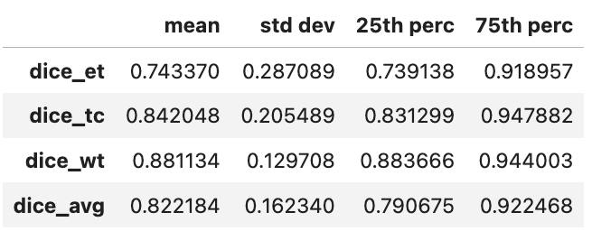
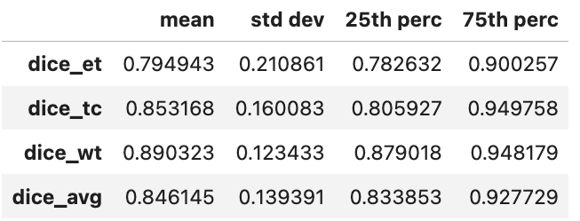

# Segmentation of brain tumor regions

**[View presentation slides about this project](https://e-tweedy.github.io/brats_slides.pdf)**

**[View the project notebook as a HTML file](https://e-tweedy.github.io/BraTS2020.html)**

In this project, we implement a 3-dimensional UNet image segmentation model in order to predict brain tumor regions from MRI scan data.

We use the Training dataset from the 2020 BraTS (Brain Tumor Segmentation) Challenge, which ran in conjunction with the 23rd annual International Conference on Medical Image Computing & Computer Assisted Intervention (MICCAI).

Each sample in the dataset consists of 3-dimensional MRI images for native (T1), post-contrast T1-weighted (T1-CE), T2-weighted (T2), T2 Fluid Attenuated Inversion Recovery (T2-FLAIR) volumes as well as a ground truth segmentation mask indicating a class label for each voxel.  For our study, we omit T1 and only use T1-CE, T2, and FLAIR channels.

For more information about the challenge and the dataset, please visit the [BraTS 2020 website.](https://www.med.upenn.edu/cbica/brats2020/)

In order to experiment with the notebook, you need to first acquire the BraTS 2020 dataset, e.g. as a .zip file from [this Kaggle dataset item](https://www.kaggle.com/datasets/awsaf49/brats20-dataset-training-validation).

## Model, training, and evaluation summary

* The model has a 3-dimensional UNet structure with four encoder levels and four decoder levels, withe group normalization after each convolution layer.
* Training samples are augmented using random Gaussian noise, random cropping, and random axis flipping in order to discourage overfitting and improve generalization.
* Segmentation masks are encoded from their original class labels to the more semantically meaningful classes of Enhancing Tumor (ET), Tumor Core (TC), and Whole Tumor (WT).  Note that voxels can have several of these classes, so this is a **multilabel classification problem.**
* The model is trained for 60 epochs using the [Ranger21 optimizer](https://github.com/lessw2020/Ranger21) and a base learning rate of ``3e-3``.
* The loss function used during training is [DiceFocalLoss](https://docs.monai.io/en/stable/losses.html#dicefocalloss) implemented in [monai.losses](https://docs.monai.io/en/stable/losses.html), which is an unweighted sum of the Focal loss and Dice loss.
* Test-time augmentation is used when making predictions on the validation or testing set: each sample was chunked into eight overlapping patches, each patch was randomly axis-flipped, and predictions were re-combined with averaging over patch overlaps.
* The model predictions are evaluated using the following metric in [torchmetrics](https://torchmetrics.readthedocs.io/en/latest/):
    * Dice score, implemented as [MultilabelF1Score](https://torchmetrics.readthedocs.io/en/stable/classification/f1_score.html)
* Summary of the scores on the validation set (20%, 74 samples):

* Summary of the scores on the testing set (20%, 74 samples):

* 
## Repository contents:

* ``BraTS2020.ipynb`` a Jupyter notebook in which training and evaluation is performed
* directory ``lib`` containing several modules used in the above notebook:
    * ``data.py`` which contains the custom torch.utils.data.Dataset class
    * ``image_utils.py`` which contains tools for manipulating and augmenting image samples
    * ``infer.py`` which contains inference and scoring functions
    * ``plot.py`` which contains functions for plotting samples
    * ``train.py`` which contains the training loop
    * ``unet.py`` which contains our UNet model class
* empty directories ``images``, ``masks``, ``trained_model`` for housing saved data as needed
* ``requirements.txt`` file
* ``BraTS2020.html`` an exported HTML version of the Jupyter notebook

## References:

[1] B. H. Menze, A. Jakab, S. Bauer, J. Kalpathy-Cramer, K. Farahani, J. Kirby, et al. "The Multimodal Brain Tumor Image Segmentation Benchmark (BRATS)", IEEE Transactions on Medical Imaging 34(10), 1993-2024 (2015) DOI: 10.1109/TMI.2014.2377694

[2] S. Bakas, H. Akbari, A. Sotiras, M. Bilello, M. Rozycki, J.S. Kirby, et al., "Advancing The Cancer Genome Atlas glioma MRI collections with expert segmentation labels and radiomic features", Nature Scientific Data, 4:170117 (2017) DOI: 10.1038/sdata.2017.117

[3] S. Bakas, M. Reyes, A. Jakab, S. Bauer, M. Rempfler, A. Crimi, et al., "Identifying the Best Machine Learning Algorithms for Brain Tumor Segmentation, Progression Assessment, and Overall Survival Prediction in the BRATS Challenge", arXiv preprint arXiv:1811.02629 (2018)

[4] S. Bakas, H. Akbari, A. Sotiras, M. Bilello, M. Rozycki, J. Kirby, et al., "Segmentation Labels and Radiomic Features for the Pre-operative Scans of the TCGA-GBM collection", The Cancer Imaging Archive, 2017. DOI: 10.7937/K9/TCIA.2017.KLXWJJ1Q

[5] S. Bakas, H. Akbari, A. Sotiras, M. Bilello, M. Rozycki, J. Kirby, et al., "Segmentation Labels and Radiomic Features for the Pre-operative Scans of the TCGA-LGG collection", The Cancer Imaging Archive, 2017. DOI: 10.7937/K9/TCIA.2017.GJQ7R0EF

[6] Olaf Ronneberger, Philipp Fischer, Thomas Brox.  U-Net: Convolutional Networks for Biomedical Image Segmentation. Medical Image Computing and Computer-Assisted Intervention (MICCAI), Springer, LNCS, Vol.9351: 234--241, 2015, available at arXiv:1505.04597 [cs.CV]

[7] Wright, Less and Demeure, Nestor. Ranger21: a synergistic deep learning optimizer.  2021, arXiv preprint arXiv:2106.13731
